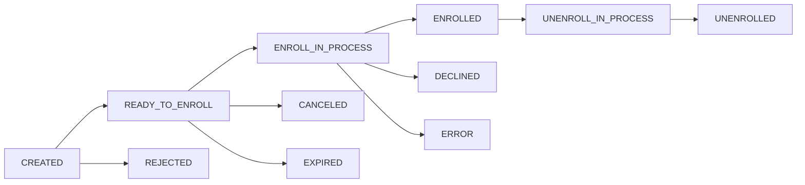

Yuno enables customers to enroll payment methods for seamless future purchases across Full or Lite payment implementations. Each payment method goes through a defined status lifecycle during the enrollment process.

<Info>
  Enrollment statuses apply to both **Full SDK** and **Lite checkout** implementations. These are distinct from [payment statuses](/reference/payment-statuses) — they track the credential vaulting lifecycle, not a payment transaction.
</Info>

## Enrollment Status Values

<ResponseField name="CREATED" type="string">
  Initial state at the time of creating a payment method. The enrollment process has not yet started.
</ResponseField>

<ResponseField name="READY_TO_ENROLL" type="string">
  The payment method is available for enrollment. The customer can proceed with the enrollment flow in the SDK.
</ResponseField>

<ResponseField name="ENROLL_IN_PROCESS" type="string">
  The payment method enrollment is being processed. Yuno is communicating with the provider to complete the enrollment.
</ResponseField>

<ResponseField name="ENROLLED" type="string">
  The payment method enrollment has been successful. A `vaulted_token` is now available for future payments.
</ResponseField>

<ResponseField name="UNENROLL_IN_PROCESS" type="string">
  Removal of the enrolled payment method is underway. The unenrollment request has been sent to the provider.
</ResponseField>

<ResponseField name="UNENROLLED" type="string">
  The payment method has been unenrolled. The `vaulted_token` is no longer valid for future payments.
</ResponseField>

<ResponseField name="DECLINED" type="string">
  The payment method enrollment failed processing at the provider level.
</ResponseField>

<ResponseField name="REJECTED" type="string">
  Yuno has declined the enrollment request. This may occur due to risk rules or validation failures.
</ResponseField>

<ResponseField name="CANCELED" type="string">
  The enrollment was terminated by the user or system before completion.
</ResponseField>

<ResponseField name="EXPIRED" type="string">
  The payment method or enrollment session has reached its expiration date before completing enrollment.
</ResponseField>

<ResponseField name="ERROR" type="string">
  There was an error in the enrollment of the payment method. This is typically a transient issue — retry the enrollment.
</ResponseField>

## Status Lifecycle

Enrollment statuses progress through the following phases:

| Phase | Statuses | Description |
|-------|----------|-------------|
| **Initial** | `CREATED` | Payment method record created, enrollment not started |
| **Ready** | `READY_TO_ENROLL` | Awaiting customer action in the SDK |
| **Processing** | `ENROLL_IN_PROCESS`, `UNENROLL_IN_PROCESS` | Provider communication in progress |
| **Success** | `ENROLLED`, `UNENROLLED` | Terminal success states |
| **Failure** | `DECLINED`, `REJECTED`, `CANCELED`, `EXPIRED`, `ERROR` | Terminal failure states |

## Enrollment Flow

A typical enrollment follows these steps:

1. **Create a [Customer Session](/api-reference/customer-sessions/create)** — generates an `sdk_token` scoped to the customer.
2. **Initialize the SDK** — use the `sdk_token` to render the enrollment UI on the client.
3. **Customer submits credentials** — the SDK tokenizes the card and begins enrollment.
4. **Monitor status** — the payment method transitions through `CREATED` → `READY_TO_ENROLL` → `ENROLL_IN_PROCESS` → `ENROLLED`.
5. **Use the vaulted token** — once `ENROLLED`, the `vaulted_token` can be used in [Checkout Sessions](/api-reference/checkout-sessions/create) for one-click payments.

<Warning>
  If enrollment results in `ERROR`, the issue is typically transient. Retry by creating a new Customer Session and re-initiating the enrollment flow. Do not reuse the same session.
</Warning>

## Related Pages

- [Customer Session Object](/api-reference/customer-sessions/object) — The session used to initiate enrollment
- [Create Customer Session](/api-reference/customer-sessions/create) — `POST /v1/customers/{customer_id}/sessions`
- [Payment Method Object](/api-reference/payment-methods/object) — The enrolled payment method record
- [Enroll Payment Method](/api-reference/payment-methods/enroll) — `POST /v1/customers/{customer_id}/payment-methods`
- [Unenroll Payment Method](/api-reference/payment-methods/unenroll) — `DELETE /v1/customers/{customer_id}/payment-methods/{id}`
- [Enrollment Guide](/guides/sdk/enrollment) — Step-by-step SDK enrollment guide
