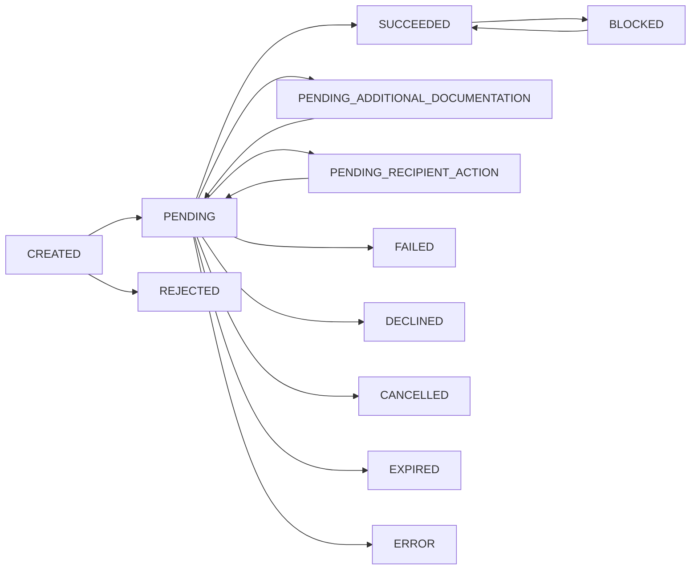

Onboarding statuses track the lifecycle of recipient (submerchant) registration with providers for split payments. Each recipient must complete onboarding before they can receive funds through marketplace splits.

<Info>
  Onboarding statuses are distinct from [payment statuses](/reference/payment-statuses). They track the credential verification and provider registration process for marketplace recipients.
</Info>

## Status Values

<ResponseField name="CREATED" type="string">
  Initial record created; validation hasn't started. Ensure data and documents are provided or await review.
</ResponseField>

<ResponseField name="PENDING" type="string">
  Under review by Yuno and/or the provider. No action needed — wait for the review to complete.
</ResponseField>

<ResponseField name="PENDING_ADDITIONAL_DOCUMENTATION" type="string">
  More documentation or clarifications are required. Upload the requested documents and resubmit.
</ResponseField>

<ResponseField name="PENDING_RECIPIENT_ACTION" type="string">
  The recipient must complete additional steps such as accepting terms, completing KYC, or identity verification. Use [Continue Onboarding](/api-reference/recipients/continue-onboarding) after the recipient completes the required actions.
</ResponseField>

<ResponseField name="SUCCEEDED" type="string">
  Onboarding completed successfully. The recipient is ready to receive split payouts.
</ResponseField>

<ResponseField name="FAILED" type="string">
  Processing failed; the onboarding was not approved. Review the failure reason and retry or create a new onboarding.
</ResponseField>

<ResponseField name="DECLINED" type="string">
  The provider reviewed and declined the onboarding. Update the recipient's information or documentation, then create a new onboarding.
</ResponseField>

<ResponseField name="BLOCKED" type="string">
  Temporarily blocked due to risk, compliance policy, or manual review. Use [Unblock Onboarding](/api-reference/recipients/unblock-onboarding) to restore, or contact support.
</ResponseField>

<ResponseField name="REJECTED" type="string">
  Pre-submission validation failed before reaching the provider. Fix the identified issues and retry.
</ResponseField>

<ResponseField name="ERROR" type="string">
  Transient processing error (e.g., timeout or connectivity issue). Retry the operation; contact support if the issue persists.
</ResponseField>

<ResponseField name="CANCELLED" type="string">
  Onboarding was cancelled by the merchant, recipient, or automatically. Create a new onboarding when ready to proceed.
</ResponseField>

<ResponseField name="EXPIRED" type="string">
  The onboarding was not completed within the allowed time window. Restart by creating a new onboarding.
</ResponseField>

## Lifecycle Phases

| Phase | Statuses | Description |
|-------|----------|-------------|
| **Initial** | `CREATED` | Record created, validation pending |
| **In Review** | `PENDING`, `PENDING_ADDITIONAL_DOCUMENTATION`, `PENDING_RECIPIENT_ACTION` | Under review or awaiting action |
| **Success** | `SUCCEEDED` | Recipient is ready for split payouts |
| **Failure** | `FAILED`, `DECLINED`, `REJECTED` | Onboarding not approved |
| **Blocked** | `BLOCKED` | Temporarily suspended |
| **Terminal** | `CANCELLED`, `EXPIRED`, `ERROR` | Process ended without completion |

## Related Pages

- [Recipient Object](/api-reference/recipients/object) — The recipient record
- [Create Onboarding](/api-reference/recipients/create-onboarding) — Start the onboarding process
- [Continue Onboarding](/api-reference/recipients/continue-onboarding) — Resume a paused onboarding
- [Block Onboarding](/api-reference/recipients/block-onboarding) — Temporarily suspend an onboarding
- [Unblock Onboarding](/api-reference/recipients/unblock-onboarding) — Restore a blocked onboarding
- [Cancel Onboarding](/api-reference/recipients/cancel-onboarding) — Cancel an in-progress onboarding
- [Split & Marketplace](/features/split-marketplace) — Overview of marketplace split payments
