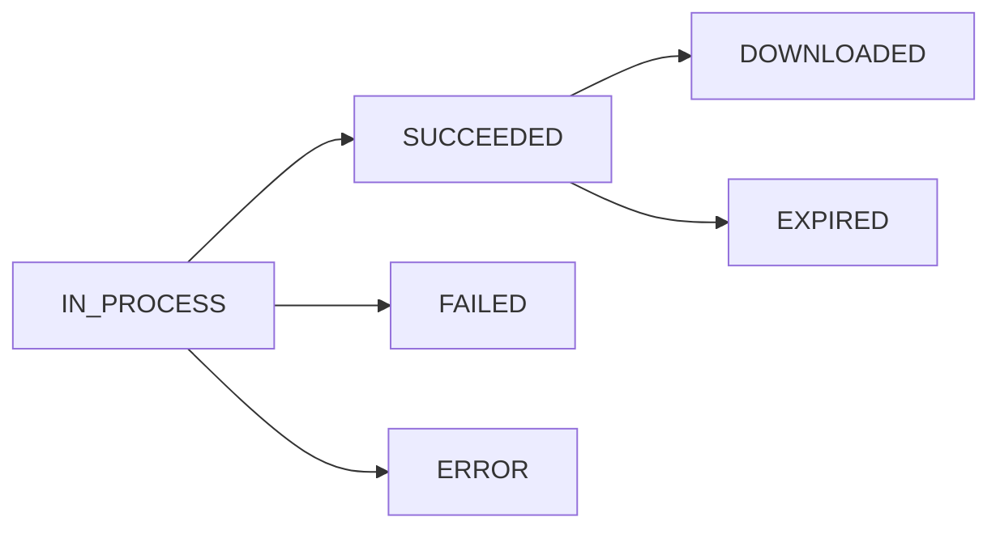

Reports are generated asynchronously. After creating a report, it progresses through the following statuses until it is ready for download or expires.

<Info>
  Report download URLs expire **10 minutes** after the report reaches `SUCCEEDED` status. After expiration, the status changes to `EXPIRED` and you must create a new report.
</Info>

## Status Values

<ResponseField name="IN_PROCESS" type="string">
  The report is being generated. Depending on the date range and report type, this may take a few seconds to several minutes.
</ResponseField>

<ResponseField name="SUCCEEDED" type="string">
  The report creation request has been executed successfully. The download URL is now available. You have 10 minutes to download before it expires.
</ResponseField>

<ResponseField name="DOWNLOADED" type="string">
  The merchant has downloaded the report.
</ResponseField>

<ResponseField name="EXPIRED" type="string">
  The report download URL has expired (10 minutes after reaching `SUCCEEDED`). Create a new report to generate a fresh download link.
</ResponseField>

<ResponseField name="FAILED" type="string">
  The report generation failed. Review the date range and filters, then retry.
</ResponseField>

<ResponseField name="ERROR" type="string">
  An unexpected error occurred during report generation. This is typically a transient issue — retry after a short wait.
</ResponseField>

## Lifecycle

| Phase | Statuses | Description |
|-------|----------|-------------|
| **Processing** | `IN_PROCESS` | Report is being generated |
| **Ready** | `SUCCEEDED` | Download URL available (10-minute window) |
| **Downloaded** | `DOWNLOADED` | Report has been downloaded |
| **Terminal** | `EXPIRED`, `FAILED`, `ERROR` | Report no longer available |

## Related Pages

- [Report Object](/api-reference/reports/object) — The report resource
- [Create Report](/api-reference/reports/create) — Generate a new report
- [Download Report](/api-reference/reports/download) — Download a generated report
